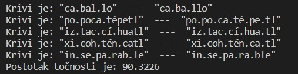

# Dokumentacija za projektni zadatak "Spanish2Syllables"

## Bilješke

Za pokretanje testiranja treba pokrenuti test.py, a za pokretanje aplikacije gui.py

---

Nakon prvog testiranja postotak točnosti rastavljenih riječi na slogove u španjolskom jeziku je bio 90.3226%

- dodan je additional rule2 (dodatno pravilo koje se može koristiti samo na zadnja 4 znaka u riječi)

Uz dodavanje novog (dodatnog) pravila točnost rastavljenih riječi je porasla na 93.5484%
Ispravile su se riječi iztaccihaul i xicohtencatl

nakon dodavanja još jedne instance rule1 i ponovnog (trećeg testiranja) točnost je 95.1613%  
ispravila se riječ popcatepetl

trenutno još nisu točne caballo, inseparable i quetzalcóatl riječi
kod quetzalcóatl - postoji problem jer rule4 rastavlja ue u-e, a to nije dozvoljeno dodavanjem još jednog rule4 rješava se problem nerastavljenih oa slova, ali problem ue i dalje ostaje
