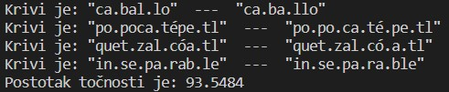

# Spanish2Syllables

## Dokumentacija za projektni zadatak - rastavljanje španjolskih riječi na slogove

###### Izradili: Toni Baskijera i Martina Sirotić

###### Kolegij: Prikaz znanja i rezoniranje o znanju

###### Ak. godina: 2022/23

---

Spanish2Syllables je projekt koji se bavi problematikom čitanja za ljude sa poteškoćama (npr. disleksičare). Implementiran je algoritam koji španjolske riječi/tekst rastavlja na slogove tako da na mjestima rastavljanja dodaje razmak (engl. space).

Postoje dvije opcije pokretanja algoritma:

- za pokretanje grafičkog korisničkog sučelja za rad sa algoritmom potrebno je pokrenuti ```gui.py``` Python skriptu
- za prikaz rezultata točnosti rastavljanja španjolskih riječi na slogove potrebno je pokrenuti ```test.py``` Python skriptu

---

## Sadržaj dokumentacije

- [Spanish2Syllables](#spanish2syllables)
  - [Dokumetnacija programskog koda](#dokumetnacija-programskog-koda)
    - [Datoteka ```algorithm.py```](#datoteka-algorithmpy)
      - [Funkcija process(string)](#funkcija-processstring)
      - [Funkcija formalize(string)](#funkcija-formalizestring)
      - [Funkcija rule\_1(formalism)](#funkcija-rule_1formalism)
      - [Funkcija rule\_2(formalism, string)](#funkcija-rule_2formalism-string)
      - [Funkcija rule\_3(formalism, string)](#funkcija-rule_3formalism-string)
      - [Funkcija rule\_4(formalism, string)](#funkcija-rule_4formalism-string)
      - [Funkcija rule\_5(formalism, string)](#funkcija-rule_5formalism-string)
      - [Funkcija rule\_6(formalism, string)](#funkcija-rule_6formalism-string)
      - [Funkcija rule\_7(formalism, string)](#funkcija-rule_7formalism-string)
      - [Funkcija rule\_8(formalism, string)](#funkcija-rule_8formalism-string)
      - [Funkcija additional\_rule\_2(formalism, string)](#funkcija-additional_rule_2formalism-string)
      - [Funkcija deformalize(string1, string2)](#funkcija-deformalizestring1-string2)
      - [Pomoćna funkcija check\_offset(string, point)](#pomoćna-funkcija-check_offsetstring-point)
    - [Datoteka ```gui.py```](#datoteka-guipy)
      - [Klasa ScrollLabel(QScrollArea)](#klasa-scrolllabelqscrollarea)
      - [Funkcija input\_text()](#funkcija-input_text)
      - [Funkcija dialog()](#funkcija-dialog)
      - [Kreiranje GUI-a](#kreiranje-gui-a)
    - [Datoteka ```test.py```](#datoteka-testpy)
      - [Funkcija convert\_docx2txt(file)](#funkcija-convert_docx2txtfile)
      - [Funkcija delete\_blank\_line(file)](#funkcija-delete_blank_linefile)
      - [Funkcija split\_element\_from\_list()](#funkcija-split_element_from_list)
      - [Funkcija create\_two\_list(list)](#funkcija-create_two_listlist)
      - [Pomoćna funkcija clean\_list(list)](#pomoćna-funkcija-clean_listlist)
      - [Funkcija average\_graph(lists)](#funkcija-average_graphlists)
      - [Pomoćna funkcija save\_table(table)](#pomoćna-funkcija-save_tabletable)
  - [Interpretacija testiranja i rada algoritma](#interpretacija-testiranja-i-rada-algoritma)
    - [Prvo testiranje](#prvo-testiranje)
    - [Drugo testiranje](#drugo-testiranje)
    - [Treće testiranje](#treće-testiranje)
    - [Tablični prikaz rastavljenih riječi na slogove](#tablični-prikaz-rastavljenih-riječi-na-slogove)
    - [Zaključak](#zaključak)

## Dokumetnacija programskog koda

### Datoteka ```algorithm.py```

Datoteka ```algorithm.py``` je najvažnija datoteka unutar projekta i služi za rastavljanje riječi ili teksta na slogove po pravilima španjoloskog jezika.

Ukratko pokretanje ```algorithm.py``` na nekoj riječi:  

1. riječ se pretvara u formalizam tako da se za svako slovo utvrdi je li sugalsnik ili samoglasnik  
2. formalizirana riječ se odvaja po slogovima tako da prolazi pravilo po pravilo dok se cijela riječ ne rastavi na slogove  
3. formalizirana riječ se ponovno vraća u "normalni" odnosno razumljivi oblik

#### Funkcija process(string)

Funkcija ```process(string)``` je glavna funkcija u kojoj se pozivaju ostale funkcije koje su većinom pravila po kojima se riječ rastavlja na slogove. Prilikom poziva funkiciji treba proslijediti riječ koju je potrebno rastaviti na slogove (npr. ```process("apple")```).  

Prvo se poziva funkcija ```formalize```, a nakon toga se pozivaju funkcije koje su zapravo pravila za rastavljanje riječi na slogove. Neke funkcije (pravila za rastavljanje riječi na slogove) se pozivaju više puta jer određene riječi zahtijevaju da se na njih pojedino pravilo primijeni nekoliko puta kako bi riječ bila točno rastavljena na slogove (npr. funkcija ```rule4(formalism, string)```.

Dodatno, u funkciji ```process(string)``` se provjerava je li riječ koju je potrebno rastaviti duža od 3 znaka. U slučaju da je riječ sadrži 4 znaka i da su (zadnja) 4 znaka samoglasnik+suglasnik+suglasnik+" na nju se primijenjuje ```additional_rule_2(formalism1, string)```

Nakon izvršavanja svih funkija koje su zapravo pravila za rastavljanje riječi na slogove poziva se funkcija ```deformalize(formalism, string)``` koja formaliziranu riječ vraća u razumljiv oblik.

Fukcija ```process(string)``` kao provatnu vrijednost vraća string odnosno proslijeđenu riječ rastavljenu na slogove.

#### Funkcija formalize(string)

Svrha funkcije ```formalize(string)``` je da slova u proslijeđenom stringu zamijeni sa V (engl. vowel) ili C (engl. consonant) ovisno o tome je li slovo samoglasnik ili suglasnik.

Slova koja spadaju u samoglanike ili suglasnike su definirana u listama ```VOWELS``` i ```CONSONANTS``` te se za svako slovo provjerava u koju listu spada. Stvara se novi sting kojem se dodaje V ili C u zamjenu za stvarno slovo u riječi. Ako znak nije slovo onda se u novi string dodaje taj znak (ne zamijenjuje se nekim drugim slovom/znakom).

Na kraju funkcija vraća formaliziranu riječ (npr. apple - VCCCV)

#### Funkcija rule_1(formalism)

Funkcija ```rule(formalism)``` kao parametar prima formalizirani string te ako u primljenom stringu postoji uzorak ```VCV``` onda se taj uzorak rastavlja kao slog na ```V-CV```. Kao povratnu vrijednost funkcija vraća formalizirani string sa rastvljenim uzorkom ```VCV```.

Za ispravno izvršavanje funkcije ```rule_1(formalism)``` potrebno je dodati modul za rad sa regularnim izrazima (```import re```).

#### Funkcija rule_2(formalism, string)

Funkcija ```rule_2(formalism, string)``` pomoću ugrađene funkcije ```finditer``` (iz modula ```re```) pronalazi sve uzorke u formalizmu koji odgovrajau zadanom ```VCCV``` uzorku i vraća iterator sa svim pronađenim uzorcima. Ako u formalizmu nema pronađenog uzorka vraća prazan iterator.

Za svaki pronađeni uzorak stvara se string suglasnika (engl. consonants) ```c_pair``` koji se zatim traži u listi ```UNALLOWED```. Ako se ```c_pair``` nalazi u listi ```UNALLOWED``` pronađeni uzorak se rastavlja na ```V-CCV```, inače se uzorak rastavlja na ```VC-CV```.

Funkcija kao provratnu vrijednost vraća formalizam koji ima rastvljene uzorke koji odgovaraju ```VCCV```.

Za ispravno izvršavanje funkcije ```rule_2(formalism, string)``` potrebno je dodati modul za rad sa regularnim izrazima (```import re```).

#### Funkcija rule_3(formalism, string)

Funkcija ```rule_3(formalism, string)``` pomoću ugrađene funkcije ```finditer``` (iz modula ```re```) pronalazi sve uzorke u formalizmu koji odgovrajau zadanom ```VCCCV``` uzorku i vraća iterator sa svim pronađenim uzorcima. Ako u formalizmu nema pronađenog uzorka vraća prazan iterator.

Za svaki pronađeni uzorak stvara se string ```end_two``` koji se zatim traži u listi ```UNALLOWED``` ili ```INSEPARABLE```. Ako se ```end_two``` nalazi u listi ```UNALLOWED``` pronađeni uzorak se rastavlja na ```VC-CCV```, a ako se string ```end_two``` nalazi u listi ```INSEPARABLE``` onda se uzorak rastavlja na ```VCC-CV```.

Funkcija kao provratnu vrijednost vraća formalizam koji ima rastvljene uzorke koji odgovaraju ```VCCCV```.

Za ispravno izvršavanje funkcije ```rule_3(formalism, string)``` potrebno je dodati modul za rad sa regularnim izrazima (```import re```).

#### Funkcija rule_4(formalism, string)

Funkcija ```rule_4(formalism, string)``` pomoću ugrađene funkcije ```finditer``` (iz modula ```re```) pronalazi sve uzorke u formalizmu koji odgovrajau zadanom ```VV``` uzorku i vraća iterator sa svim pronađenim uzorcima. Ako u formalizmu nema pronađenog uzorka vraća prazan iterator.

Za svaki pronađeni uzorak stvara se string suglasnika ```v_pair``` koji se zatim traži u listi ```STRONG_STRONG_VOWEL_PAIRS```. Ako se ```v_pair``` nalazi u listi ```STRONG_STRONG_VOWEL_PAIRS``` pronađeni uzorak se rastavlja na ```V-V```, inače se uzorak ne rastavlja odnosno ostaje ```VV```.

Funkcija kao provratnu vrijednost vraća formalizam koji zadovoljava uvjete za (ne)rastavljanje uzorka ```VV```.

Za ispravno izvršavanje funkcije ```rule_4(formalism, string)``` potrebno je dodati modul za rad sa regularnim izrazima (```import re```).

#### Funkcija rule_5(formalism, string)

Funkcija ```rule_5(formalism, string)``` pomoću ugrađene funkcije ```finditer``` (iz modula ```re```) pronalazi sve uzorke u formalizmu koji odgovrajau zadanom ```VV``` uzorku i vraća iterator sa svim pronađenim uzorcima. Ako u formalizmu nema pronađenog uzorka vraća prazan iterator.

Za svaki pronađeni uzorak stvara se string suglasnika ```v_pair``` koji se zatim traži u listi ```STRONG_WEAK_VOWEL_PAIRS```. Ako se ```v_pair``` nalazi u listi ```STRONG_WEAK_VOWEL_PAIRS``` pronađeni uzorak se ne rastavlja, ostaje ```VV```.

Funkcija kao provratnu vrijednost vraća formalizam koji nema rastavljen uzorak ```VV``` ako se ```v_pair``` nalazi u listi ```STRONG_WEAK_VOWEL_PAIRS```.

Za ispravno izvršavanje funkcije ```rule_5(formalism, string)``` potrebno je dodati modul za rad sa regularnim izrazima (```import re```).

#### Funkcija rule_6(formalism, string)

Funkcija ```rule_6(formalism, string)``` pomoću ugrađene funkcije ```finditer``` (iz modula ```re```) pronalazi sve uzorke u formalizmu koji odgovrajau zadanom ```VV``` uzorku i vraća iterator sa svim pronađenim uzorcima. Ako u formalizmu nema pronađenog uzorka vraća prazan iterator.

Za svaki pronađeni uzorak stvara se string suglasnika ```v_pair``` koji se zatim traži u listi ```WEAK_WEAK_VOWEL_PAIRS```. Ako se ```v_pair``` nalazi u listi ```WEAK_WEAK_VOWEL_PAIRS``` pronađeni uzorak se ne rastavlja, ostaje ```VV```.

Funkcija kao provratnu vrijednost vraća formalizam koji nema rastavljen uzorak ```VV``` ako se ```v_pair``` nalazi u listi ```WEAK_WEAK_VOWEL_PAIRS```.

Za ispravno izvršavanje funkcije ```rule_6(formalism, string)``` potrebno je dodati modul za rad sa regularnim izrazima (```import re```).

#### Funkcija rule_7(formalism, string)

Funkcija ```rule_7(formalism, string)``` pomoću ugrađene funkcije ```finditer``` (iz modula ```re```) pronalazi sve uzorke u formalizmu koji odgovrajau zadanom ```VVV``` uzorku i vraća iterator sa svim pronađenim uzorcima. Ako u formalizmu nema pronađenog uzorka vraća prazan iterator.

Za svaki pronađeni uzorak stvara se string suglasnika ```v_pair``` koji se zatim traži u listi ```WEAK_STRONG_WEAK_VOWEL_TRIFTONG```. Ako se ```v_pair``` nalazi u listi ```WEAK_STRONG_WEAK_VOWEL_TRIFTONG``` pronađeni uzorak se ne rastavlja, ostaje ```VVV```.

Funkcija kao provratnu vrijednost vraća formalizam koji nema rastavljen uzorak ```VVV``` ako se ```v_pair``` nalazi u listi ```WEAK_STRONG_WEAK_VOWEL_TRIFTONG```.

Za ispravno izvršavanje funkcije ```rule_7(formalism, string)``` potrebno je dodati modul za rad sa regularnim izrazima (```import re```).

#### Funkcija rule_8(formalism, string)

Funkcija ```rule_8(formalism, string)``` pomoću ugrađene funkcije ```finditer``` (iz modula ```re```) pronalazi sve uzorke u formalizmu koji odgovrajau zadanom ```VV``` uzorku i vraća iterator sa svim pronađenim uzorcima. Ako u formalizmu nema pronađenog uzorka vraća prazan iterator.

Za svaki pronađeni uzorak stvara se string ```v_pair``` koji se zatim traži u listi ```STRONG_WEAK_TO_STRONG_VOWEL_PAIRS```. Ako se ```v_pair``` nalazi u listi ```STRONG_WEAK_TO_STRONG_VOWEL_PAIRS``` pronađeni uzorak se rastavlja na ```V-V```, inače se uzorak ne rastavlja, ostaje ```VV```.

Funkcija kao provratnu vrijednost vraća formalizam koji zadovoljava uvjete za (ne)rastavljanje uzorka ```VV```.

Za ispravno izvršavanje funkcije ```rule_8(formalism, string)``` potrebno je dodati modul za rad sa regularnim izrazima (```import re```).

#### Funkcija additional_rule_2(formalism, string)

Funkcija ```additional_rule_2(formalism, string)``` pomoću ugrađene funkcije ```finditer``` (iz modula ```re```) pronalazi sve uzorke u formalizmu koji odgovrajau zadanom ```VCC``` uzorku i vraća iterator sa svim pronađenim uzorcima. Ako u formalizmu nema pronađenog uzorka vraća prazan iterator.

Za svaki pronađeni uzorak stvara se string suglasnika (engl. consonants) ```c_pair``` koji se zatim traži u listi ```UNALLOWED```. Ako se ```c_pair``` nalazi u listi ```UNALLOWED``` pronađeni uzorak se rastavlja na ```V-CC```, inače se uzorak rastavlja na ```VC-C```.

Funkcija kao provratnu vrijednost vraća formalizam koji ima rastvljene uzorke koji odgovaraju ```VCC```.

Za ispravno izvršavanje funkcije ```additional_rule_2(formalism, string)``` potrebno je dodati modul za rad sa regularnim izrazima (```import re```).

#### Funkcija deformalize(string1, string2)

Funkcija ```deformalize(string1, string2)``` prolazi kroz proslijeđeni parametar ```string1``` znak po znak. Ako je trenutni znak jednak ```-``` onda se u listu ```list_of_char``` dodaje razmak, inače se u listu ```list_of_char``` dodaje znak iz proslijeđenog parametra ```string2``` koji se nalazi na istom mjestu kao i pročitani znak i povećava se brojač.

Lista ```list_of_char``` se spaja u jedan string sa svim elementima liste nakon što su pročitani i obrađeni svi znakovi iz proslijeđenog paramtera ```string1```.

Funkcija kao povratnu vrijednost vraća deformalizirani string, točnije vraća string koji je razumljiv čovjeku (nije formaliziran i ne sadrži samo V ili C kao zamjenu za svako slovo), ali se na mjestima rastavljanja slogova nalazi razmak (npr. "casa" -> "ca sa").

#### Pomoćna funkcija check_offset(string, point)

Pomoćna funkcija ```check_offset(string, point)``` se koristi prilikom definiranja stringova tj. parova u funkcijama koje su zapravo pravila za rastavljanje riječi na slogove. Svrha funkcije ```check_offset(string, point)``` je da prebroji koliko ima znakova ```-``` u riječi kako bi se zano dodat pomak u brojaču prilikom definiranja parova.

Funkcija kao povratnu vrijednost vraća cijeli broj koji označava broj znakova jednakih ```-``` u zadanoj riječi.

### Datoteka ```gui.py```

Svrha datoteke ```gui.py``` je kreiranje grafičkog korisničkog sučelja za rad sa algoritmom za rastavljanje riječi na slogove.

GUI je kreiran pomoću ```PyQt5``` Python-ovog modula. Modul je potrebno instalirati prije samog dodavanja jer ne spada u osnovne ugrađene module. Za instalaciju potrebno je u terminalu pokrenuti naredbu ```sudo apt-get install qt5-default``` ako se koristi Linux (Ubuntu) operacijski sustav, a ```pip install PyQt5``` ako se koristi Windows OS.


#### Klasa ScrollLabel(QScrollArea)

Klasa ```ScrollLabel(QScrollArea)``` je definirana kako bi bilo omogućeno "skrolanje" odnosno prelistavanje teksta u slučaju da je tekst duži od veličine okvira u kojoj se prikazuje.

Prilikom definiranja klase omogućeno je da se veličina okvira prilagođava tekstu, odnosno da se sa krajem teksta zatvara i okvir u kojem se tekst prikazuje. Okvir u kojem se tekst prikazuje nije statički definiran već se prilagođava ovisno o dužini teksta.
Također omogućeno je da se tekst koji se prikazuje unutar GUI-a prelama ovisno o dužini retka, ne poštuje se poravnanje i dužina retka koji su bili prije definirani npr. unutar datoteke.

#### Funkcija input_text()

Funkcija ```input_text()``` omogućuje korisniku da unosi proizvoljan tekst u GUI koji želi rastaviti na slogove. Pritiskom na gumb ```Add text``` korisniku se otvara prozor za unos teksta.


Unos teksta omogućava funkcija ```QInputDialog.getText(win, "Input Text", "Text: ", QLineEdit.Normal, "")``` gdje ```QInputDialog``` stvara prozor za unos teksta, ```getText``` omogućava unost teksta, a paramteri ```win``` označava da se prozor mora nalaziti unutar definiranog roditeljskog prozora, ```Input Text``` je naslov prozora, ```Text:``` je tekst iznad polja za unos teksta, a ```QLineEdit.Normal, ""``` omogućava rad sa tekstom u jednoj liniji bez početnog defaultnog teksta.

Kada korisnik unese željeni tekst i pritisne ```OK``` poziva se funkcija ```label.setText(...)``` koja postavljeni "defaultni" tekst zamijenjuje unesenim tekstom koji je rastvaljen na slogove.

#### Funkcija dialog()

Funkcija ```dialog()``` omogućava dodavanje teksta, koji se rastavlja na slogove, putem teksutalne datoteke.

Odabir mape ili datoteke dopušta ```QFileDialog```, a ```QFileDialog.getOpenFileName``` omogućava otvaranje datoteke koja mora biti prije kreirana (nema mogućnost trenutnog stvranja datoteke). Parametra ```None``` znači da nema roditeljskog widgeta pa će onda novi prozor kada se otvori biti centriran u roditeljskom/osnovnom prozoru. Naslov prozora u kojem se odabire datoteka koja sadrži tekst za rastavljanje na slogove se definira kao drugi parametar ```QFileDialog.getOpenFileName()```, treći paramtar u ovom slučaju ```""``` označava putanju do mape/direktorija u kojem se odabire datoteka. Ako je u putanji navedena i datoteka odmah će se otvoriti. U ovom slučaju putanja do određene datoteke nije navedena pa će korisnik sam pretražiti uređaj i doći do datoteke koju želi otvoriti, a prozor za odabir datoteke će se otvoriti u mapi/direktoriju projekta. Čestvrti parametar u pozivu funkcije za dodatavanje datoteke je vrsta datoteke koju se može otvoriti ```Text Files (*.txt)```, samo tekstualne (.txt) datoteke.


Nakon odabira i dodavanja datoteke, datoteka se otvara i čita se linija po linija u datoteci, svaka linija se rastavlja na riječi po razmacima (engl. space). Svaka riječ se rastavlja na slogove te se nakon toga dodaje u listu ```new_list```. Kada se sve riječi rastave na slogove, svi elementi liste se spajaju u jedan string ```new_string``` tako da se između elemenata liste dodaje razmak (engl. space). Naredbom ```label2.setText(new_string)``` se u okviru ```label2``` prikazuje tekst rastavljen na slogove.

#### Kreiranje GUI-a

Kako bi se pojavilo grafičko korisničko sučelje potrebno je definirati aplikaciju ```app = QApplication(sys.argv)```. Za ispavno definiranje aplikacije treba dodati modul za rad sa specifičnim funkcijama i parametrima (```import sys```). Nakon toga se definira glavni/roditeljski prozor ```win = QMainWindow()``` te se postave geometrijke koordinate prozora ```win.setGeometry(200,200,200,200)```, gdje je prvi parametar x-koordinata, drugi y-koordinata, treći širina prozora i četvrti visina prozora.

Za prikaz korisničkog sučelja potrebno je dodati ```win.show()```. Nakon upotrebe aplikacije, korisnik zatvara aplikaciju pomoću ```sys.exit(app.exec_())``` naredbe.

### Datoteka ```test.py```

Datoteka ```test.py``` služi za testiranje algoritma za rastavljanje riječi na slogove. Za testiranje se čitaju riječi iz datoteke i pročitane riječi rastavljaju na slogove te se uspoređuju sa rastavljenim riječima koje su zapisane u datoteci. Ako rastavljena riječ i rastavljena riječ iz datoteke nisu iste, riječ se ispisuje u terminalu kao krivo rastvljena.

#### Funkcija convert_docx2txt(file)

Procesiranje i rad sa .docx formatom datoteka u Python-u je otežano pa se funkcijom ```convert_docx2txt(file)``` rješava taj problem.

Funkcija ```convert_docx2txt(file)``` kao parametar prima datoteku koju je potrebno konvertorati iz .docx formata u tekstualnu datoteku. Prilikom konvertiranja, ako već ne postoji, stvara se datoteka ```output.txt``` u koju se zapisuje sadržaj iz proslijeđene .docx datoteke. Sadržaj koji se zapisuje u ```output.txt``` datoteku se ispisuje i u terminalu.

Za ispravno konvertiranje ```.docx``` formata u ```.txt``` format potrebno je dodati modul za konvertiranje formata datoteke (```import docx2txt```). Modul za konvertiranje formata datoteka nije osnovni ugrađeni modul pa ga je prvo potrebno instalirati pokretanjem naredbe u terminalu ```sudo apt-get install docx2txt``` ako se koristi Linux (Ubuntu) OS ili ```pip install docx2txt``` ako se koiristi Windows OS.

#### Funkcija delete_blank_line(file)

Funkcija ```delete_blank_line(file)``` kao parametar prima datoteku iz koje je potrebno izbrisati prazne linije. Datoteka se otvara dva puta odjednom, za čitanje ```r``` i za izmjenu ```r+```. Čita se linija po linija iz datoteke za čitanje i ako linija nije prazna onda se zapisuje u datoteku za promjene.

#### Funkcija split_element_from_list()

Funkcija ```split_element_from_list()``` otvara datoteku ```output.txt``` samo za čitanje te se iz datoteke čita linija po linija. Svaka pročitana linija se odvaja po znakovima ``` – ``` ili ``` - ``` te se dobivena lista znakova dodaje u listu ```new_list```. Nakon što se pročita i procesira cijela datoteka spajaju se sve podliste u listi ```new_list```.

Funkcija kao povratnu vrijednost vraća listu pročitanih stringova iz datoteke ```output.txt```.

Za ispravno odvajanje stringova unutar pojedine linije potrebno je dodati modul za rad sa regularnim izrazima (```import re```).

#### Funkcija create_two_list(list)

Cilj funkcije ```create_two_list(list)``` je da proslijeđenu listu odvoji u dvije nove liste na način da jedna lista sadrži elemente/riječi koje se moraju rastaviti na slogove, a druga lista sadrži iste riječi rastavljene na slogove.

Proslijeđena lista se rastvlja na dvije liste, listi ```list_words_for_test``` se dodaju svi elementi na parnim pozicijama iz proslijeđene liste odnosno riječi koje treba rastaviti na slogove. Drugoj listi ```list_syllables_compare``` se dodaju elementi na neparnim pozicijama iz proslijeđene liste točnije elemente/riječi koje su točno rastavljene slogove. Listu ```list_syllables_compare``` je potrebno očistiti od nepotrebnih znakova te se za to poziva pomoćna funkcija ```clean_list(list_syllables_compare)```.

Svaki element iz liste ```list_words_for_test``` se rastavlja na slogove pomoću funkcije ```process(item)``` iz ```algorithm.py``` datoteke. Rastavljena riječ na slogove se uređuje odnosno zamijenjuje se razmak (engl. space) sa ```.``` kako bi kasnije bila omogućena usporedba sa istom riječi iz liste ```list_syllables_compare```. Nakon zamjene znakova rastavljena riječ se dodaje u listu ```list_syllables```.

Svaki element iz liste ```list_syllables``` uspoređuje se sa elementom na istoj poziciji u listi ```list_syllables_compare``` kako bi se utvrdila točnost rastvaljanja riječi na slogove. Ako vrijedi da je elemet na i-toj poziciji u listi ```list_syllables``` jedank elementu na i-toj pozicji u listi ```list_syllables_compare``` povećava se brojač ```true_counter``` koji broji koliko je riječi točno rastvaljeno na slogove. U slučaju da elemeti na i-toj poziciji u listama nisu jednaki element se ispisuje u terminalu ```print("Krivi je:", list_syllables[i], " --- ", list_syllables_compare[i])```.

Kao povratnu vrijednost funkcija vraća brojač ```true_counter``` i liste ```list_syllables_compare```, ```list_syllables```, ```list_words_for_test```.

#### Pomoćna funkcija clean_list(list)

Funkcija ```clean_list(list)``` kao parametar prima listu koju je potrebno očistiti od neželjenih znakova.

Prolazi se kroz proslijeđenu listu, te se za svaki element liste dodatno provjerava svaki znak. Ako je svaki znak slovo ili ```"``` ili ```.``` znak se dodaje u listu ```new_list```. Kada se procesira cijeli element liste, lista ```new_list``` se spaja u jedan string te se taj string dodaje u listu očišćenih elemenata ```clean_list```.

Funkcija kao povratnu vrijednost vraća očišćenu proslijeđenu listu ```clean_list```.

#### Funkcija average_graph(lists)

Svrha funkcije ```average_graph(lists)``` je da izračuna prosjek točno rastvljenih riječi na slogove te da prikaže graf točnosti i tablicu sa rastavljenim riječima.

Za krairanje grafa potrebno je definirati opise ```corectVSincorrect = ['correct', 'incorrect']``` podataka i podatke. Graf se kreira iz podataka koji su definirani u funkciji ```create_two_list(list)```.

```python
lista = create_two_list(lists)
corectVSincorrect = ['correct', 'incorrect']
data = [lista[0], (len(lista[1])-lista[0])]
```

Za prikazivanje grafa potrebno je dodati modul za vizualizacije (```from matplotlib import pyplot as plt```). Modul ```matplotlib``` je potrebno instalirati pokretanjem naredbe ```sudo apt-get install python3-matplotlib``` ako se koristi Linux (Ubuntu) OS ili ```pip install matplotlib``` ako se koristi Windows OS.

Osim prikazivanja grafa funkcija kreira tablicu sa četiri stupca. U prvom stupcu se prikazuje redni broj riječi koju je potrebno rastaviti na slogove, u drugom stupcu se nalazi riječ koju je potrebno rastaviti na slogove, u trećem stupcu riječ rastavljena na slogove, a u četvrtom stupcu točno rastavljena riječ na slogove. Funkcija ```tabulate``` kreira tablicu tako da elemente na istim pozicijama iz listi ```list_words_for_test```, ```list_syllables``` i ```list_syllables_compare``` prikazuje u istom retku u tablici. Tablica se prikazuje u terminalu, ali se još dodatno sprema u datoteku pomoću funkcije ```save_table(table)```.

Za korištenje funkcije ```tabulate``` potrebno je dodati modul za rad sa tablicama ```from tabulate import tabulate```, modul je potrebno instalirati pokretanjem naredbe u terminalu. Za Linux (Ubuntu) OS potrebno je pokrenuti ```sudo apt-get install python3-tabulate```, a za Windows OS ```pip install tabulate```.

Funkcija ```average_graph(lists)``` kao povratnu vrijednost vraća numeričku vrijednost točnije postotak točnosti rastvljanja riječi na slogove.

#### Pomoćna funkcija save_table(table)

Pomoćna funkcija ```save_table(table)``` kao paramterar prima string odnosno tablicu koji će spremiti u datoteku.

Funkcija ```save_table(table)``` otvara datoteku ```table.txt```, ako datoteka već ne postoji u trenutnku otvaranja datoteka se kreira i otvara. U datoteku ```table.txt``` se zapisuje tablica koja je proslijeđena.

```textual
╒═══════╤════════════════╤═════════════════════╤══════════════════════════╕
│   No. │ Word           │ Word2Syllables      │ Correct Word2Syllables   │
╞═══════╪════════════════╪═════════════════════╪══════════════════════════╡
│     1 │ "caballo"      │ "ca.bal.lo"         │ "ca.ba.llo"              │
├───────┼────────────────┼─────────────────────┼──────────────────────────┤
│     2 │ "maleta"       │ "ma.le.ta"          │ "ma.le.ta"               │
├───────┼────────────────┼─────────────────────┼──────────────────────────┤
│     3 │ "sótano"       │ "só.ta.no"          │ "só.ta.no"               │
├───────┼────────────────┼─────────────────────┼──────────────────────────┤
│     4 │ "abuelo"       │ "a.bue.lo"          │ "a.bue.lo"               │
├───────┼────────────────┼─────────────────────┼──────────────────────────┤
│     5 │ "charlar"      │ "char.lar"          │ "char.lar"               │

```

## Interpretacija testiranja i rada algoritma

Nakon implementacije algoritma, slijedilo je testiranje. Algoritam za rastavljanje španjloskih riječi na slogove testiran je tri puta na skupu podataka za testiranje iz datoteke ```SPANISH_primjeri.docx```.

### Prvo testiranje

Nakon prvog testiranja postotak točnosti rastavljenih riječi na slogove u španjolskom jeziku je bio 90.3226%.


Tijekom testiranja utvrđeno je koje riječi su krivo rastavljene (caballo, popocatépetl, iztaccíhuatl, xicohténcatl, quetzalcóatl, inseparable) te smo zaključili da je potrebno dodati novo pravilo kako bi se dio riječi pravilo rastavio na slogove.


Implementirali smo novo pravilo ```additional_rule_2(formalism, string)``` koje djeluje na zadnja tri slova u riječi. Naime, zaključili smo kako pravilo ```rule_2(formalism, string)``` traži uzorke koji odgovaraju ```VCCV```, ali postoje riječi kojima zadnja tri slova odgovaraju uzorku ```VCC``` te pravilo ```rule_2(formalism, string)``` ne rastavlja riječi na slogove točno.
Dodatnim pravilom ```additional_rule_2(formalism, string)``` provjerava se odgovaraju li zadnja tri slova u riječi uzorku ```VCC``` te ukoliko odgovaraju na tom uzorku se primijenjuje pravilo za rastavljanje na slogove isto kao i ```rule_2(formalism, string)``` samo se tijekom rastavljanja zanemaruje zadnji suglasnik u uzorku ```VCCV```.

```python
def additional_rule_2(formalism, string):
    pattern = re.finditer("VCC", formalism)
    if pattern is None:
            return formalism
    for object in pattern:
        pattern_start = object.start()
        consonant1 = pattern_start+1
        consonant2 = pattern_start+2
        offset = check_offset(formalism, pattern_start)
        c_pair = string[consonant1 - offset] + string[consonant2 - offset]
        if c_pair in UNALLOWED:
            formalism = re.sub("VCC", "V-CC", formalism, 1)
        else:
            formalism = re.sub("VCC", "VC-C", formalism, 1)
    return formalism
```

### Drugo testiranje

Uz dodavanje novog (dodatnog) pravila ```additional_rule_2(formalism, string)``` točnost rastavljenih riječi je porasla na 93.5484%.


Ispravile su se riječi iztaccíhuatl i xicohténcatl.



Uočili smo da bi se dodavanjem još jednog poziva funkcije ```rule_1(formalism)``` ispravila riječ popocatépetl.

### Treće testiranje

Ponovili smo testiranje nakon dodavanja još jednog poziva funkcije ```rule_1(formalism)``` i sada je točnost 95.1613%.


Kao što smo pretpostavili nakon dodavanja novog poziva funkcije riječ popocatépetl se ispravno rastavlja na slogove.


### Tablični prikaz rastavljenih riječi na slogove

```texstual
╒═══════╤════════════════╤═════════════════════╤══════════════════════════╕
│   No. │ Word           │ Word2Syllables      │ Correct Word2Syllables   │
╞═══════╪════════════════╪═════════════════════╪══════════════════════════╡
│     1 │ "caballo"      │ "ca.bal.lo"         │ "ca.ba.llo"              │
├───────┼────────────────┼─────────────────────┼──────────────────────────┤
│     2 │ "maleta"       │ "ma.le.ta"          │ "ma.le.ta"               │
├───────┼────────────────┼─────────────────────┼──────────────────────────┤
│     3 │ "sótano"       │ "só.ta.no"          │ "só.ta.no"               │
├───────┼────────────────┼─────────────────────┼──────────────────────────┤
│     4 │ "abuelo"       │ "a.bue.lo"          │ "a.bue.lo"               │
├───────┼────────────────┼─────────────────────┼──────────────────────────┤
│     5 │ "charlar"      │ "char.lar"          │ "char.lar"               │
├───────┼────────────────┼─────────────────────┼──────────────────────────┤
│     6 │ "mártir"       │ "már.tir"           │ "már.tir"                │
├───────┼────────────────┼─────────────────────┼──────────────────────────┤
│     7 │ "costar"       │ "cos.tar"           │ "cos.tar"                │
├───────┼────────────────┼─────────────────────┼──────────────────────────┤
│     8 │ "mandar"       │ "man.dar"           │ "man.dar"                │
├───────┼────────────────┼─────────────────────┼──────────────────────────┤
│     9 │ "popocatépetl" │ "po.po.ca.té.pe.tl" │ "po.po.ca.té.pe.tl"      │
├───────┼────────────────┼─────────────────────┼──────────────────────────┤
│    10 │ "iztaccíhuatl" │ "iz.tac.cí.hua.tl"  │ "iz.tac.cí.hua.tl"       │
├───────┼────────────────┼─────────────────────┼──────────────────────────┤
│    11 │ "xicohténcatl" │ "xi.coh.tén.ca.tl"  │ "xi.coh.tén.ca.tl"       │
├───────┼────────────────┼─────────────────────┼──────────────────────────┤
│    12 │ "quetzalcóatl" │ "qu.et.zal.có.a.tl" │ "quet.zal.có.a.tl"       │
├───────┼────────────────┼─────────────────────┼──────────────────────────┤
│    13 │ "casa"         │ "ca.sa"             │ "ca.sa"                  │
├───────┼────────────────┼─────────────────────┼──────────────────────────┤
│    14 │ "miraron"      │ "mi.ra.ron"         │ "mi.ra.ron"              │
├───────┼────────────────┼─────────────────────┼──────────────────────────┤
│    15 │ "demora"       │ "de.mo.ra"          │ "de.mo.ra"               │
├───────┼────────────────┼─────────────────────┼──────────────────────────┤
│    16 │ "oprimo"       │ "o.pri.mo"          │ "o.pri.mo"               │
├───────┼────────────────┼─────────────────────┼──────────────────────────┤
│    17 │ "obrero"       │ "o.bre.ro"          │ "o.bre.ro"               │
├───────┼────────────────┼─────────────────────┼──────────────────────────┤
│    18 │ "aplomo"       │ "a.plo.mo"          │ "a.plo.mo"               │
├───────┼────────────────┼─────────────────────┼──────────────────────────┤
│    19 │ "hablando"     │ "ha.blan.do"        │ "ha.blan.do"             │
├───────┼────────────────┼─────────────────────┼──────────────────────────┤
│    20 │ "cafre"        │ "ca.fre"            │ "ca.fre"                 │
├───────┼────────────────┼─────────────────────┼──────────────────────────┤
│    21 │ "aflojar"      │ "a.flo.jar"         │ "a.flo.jar"              │
├───────┼────────────────┼─────────────────────┼──────────────────────────┤
│    22 │ "agrandar"     │ "a.gran.dar"        │ "a.gran.dar"             │
├───────┼────────────────┼─────────────────────┼──────────────────────────┤
│    23 │ "aglutinar"    │ "a.glu.ti.nar"      │ "a.glu.ti.nar"           │
├───────┼────────────────┼─────────────────────┼──────────────────────────┤
│    24 │ "acróbata"     │ "a.cró.ba.ta"       │ "a.cró.ba.ta"            │
├───────┼────────────────┼─────────────────────┼──────────────────────────┤
│    25 │ "aclamar"      │ "a.cla.mar"         │ "a.cla.mar"              │
├───────┼────────────────┼─────────────────────┼──────────────────────────┤
│    26 │ "cuadro"       │ "cua.dro"           │ "cua.dro"                │
├───────┼────────────────┼─────────────────────┼──────────────────────────┤
│    27 │ "cuatro"       │ "cua.tro"           │ "cua.tro"                │
├───────┼────────────────┼─────────────────────┼──────────────────────────┤
│    28 │ "atlas"        │ "a.tlas"            │ "a.tlas"                 │
├───────┼────────────────┼─────────────────────┼──────────────────────────┤
│    29 │ "atlalilco"    │ "a.tla.lil.co"      │ "a.tla.lil.co"           │
├───────┼────────────────┼─────────────────────┼──────────────────────────┤
│    30 │ "inseparable"  │ "in.se.pa.rab.le"   │ "in.se.pa.ra.ble"        │
├───────┼────────────────┼─────────────────────┼──────────────────────────┤
│    31 │ "artista"      │ "ar.tis.ta"         │ "ar.tis.ta"              │
├───────┼────────────────┼─────────────────────┼──────────────────────────┤
│    32 │ "obtener"      │ "ob.te.ner"         │ "ob.te.ner"              │
├───────┼────────────────┼─────────────────────┼──────────────────────────┤
│    33 │ "cuenta"       │ "cuen.ta"           │ "cuen.ta"                │
├───────┼────────────────┼─────────────────────┼──────────────────────────┤
│    34 │ "comedlo"      │ "co.med.lo"         │ "co.med.lo"              │
├───────┼────────────────┼─────────────────────┼──────────────────────────┤
│    35 │ "ponedla"      │ "po.ned.la"         │ "po.ned.la"              │
├───────┼────────────────┼─────────────────────┼──────────────────────────┤
│    36 │ "empleados"    │ "em.ple.a.dos"      │ "em.ple.a.dos"           │
├───────┼────────────────┼─────────────────────┼──────────────────────────┤
│    37 │ "englobar"     │ "en.glo.bar"        │ "en.glo.bar"             │
├───────┼────────────────┼─────────────────────┼──────────────────────────┤
│    38 │ "inflamar"     │ "in.fla.mar"        │ "in.fla.mar"             │
├───────┼────────────────┼─────────────────────┼──────────────────────────┤
│    39 │ "contraer"     │ "con.tra.er"        │ "con.tra.er"             │
├───────┼────────────────┼─────────────────────┼──────────────────────────┤
│    40 │ "constitución" │ "cons.ti.tu.ción"   │ "cons.ti.tu.ción"        │
├───────┼────────────────┼─────────────────────┼──────────────────────────┤
│    41 │ "instaurar"    │ "ins.tau.rar"       │ "ins.tau.rar"            │
├───────┼────────────────┼─────────────────────┼──────────────────────────┤
│    42 │ "obstinado"    │ "obs.ti.na.do"      │ "obs.ti.na.do"           │
├───────┼────────────────┼─────────────────────┼──────────────────────────┤
│    43 │ "obstáculo"    │ "obs.tá.cu.lo"      │ "obs.tá.cu.lo"           │
├───────┼────────────────┼─────────────────────┼──────────────────────────┤
│    44 │ "aéreo"        │ "a.é.re.o"          │ "a.é.re.o"               │
├───────┼────────────────┼─────────────────────┼──────────────────────────┤
│    45 │ "pelear"       │ "pe.le.ar"          │ "pe.le.ar"               │
├───────┼────────────────┼─────────────────────┼──────────────────────────┤
│    46 │ "leo"          │ "le.o"              │ "le.o"                   │
├───────┼────────────────┼─────────────────────┼──────────────────────────┤
│    47 │ "aire"         │ "ai.re"             │ "ai.re"                  │
├───────┼────────────────┼─────────────────────┼──────────────────────────┤
│    48 │ "europa"       │ "eu.ro.pa"          │ "eu.ro.pa"               │
├───────┼────────────────┼─────────────────────┼──────────────────────────┤
│    49 │ "ásia"         │ "á.sia"             │ "á.sia"                  │
├───────┼────────────────┼─────────────────────┼──────────────────────────┤
│    50 │ "bueno"        │ "bue.no"            │ "bue.no"                 │
├───────┼────────────────┼─────────────────────┼──────────────────────────┤
│    51 │ "cuidado"      │ "cui.da.do"         │ "cui.da.do"              │
├───────┼────────────────┼─────────────────────┼──────────────────────────┤
│    52 │ "ruidoso"      │ "rui.do.so"         │ "rui.do.so"              │
├───────┼────────────────┼─────────────────────┼──────────────────────────┤
│    53 │ "triunfante"   │ "triun.fan.te"      │ "triun.fan.te"           │
├───────┼────────────────┼─────────────────────┼──────────────────────────┤
│    54 │ "ciudad"       │ "ciu.dad"           │ "ciu.dad"                │
├───────┼────────────────┼─────────────────────┼──────────────────────────┤
│    55 │ "cuidado"      │ "cui.da.do"         │ "cui.da.do"              │
├───────┼────────────────┼─────────────────────┼──────────────────────────┤
│    56 │ "ruidoso"      │ "rui.do.so"         │ "rui.do.so"              │
├───────┼────────────────┼─────────────────────┼──────────────────────────┤
│    57 │ "triunfante"   │ "triun.fan.te"      │ "triun.fan.te"           │
├───────┼────────────────┼─────────────────────┼──────────────────────────┤
│    58 │ "ciudad"       │ "ciu.dad"           │ "ciu.dad"                │
├───────┼────────────────┼─────────────────────┼──────────────────────────┤
│    59 │ "había"        │ "ha.bí.a"           │ "ha.bí.a"                │
├───────┼────────────────┼─────────────────────┼──────────────────────────┤
│    60 │ "país"         │ "pa.ís"             │ "pa.ís"                  │
├───────┼────────────────┼─────────────────────┼──────────────────────────┤
│    61 │ "reúno"        │ "re.ú.no"           │ "re.ú.no"                │
├───────┼────────────────┼─────────────────────┼──────────────────────────┤
│    62 │ "baúl"         │ "ba.úl"             │ "ba.úl"                  │
╘═══════╧════════════════╧═════════════════════╧══════════════════════════╛
```

### Zaključak

Nakon provedenih optimizacija i testiranja algoritma za rastavljanje španjolskih riječi na slogove zaključili smo da se riječi caballo, quetzalcóatl, inseparable ne rastavljaju točno na slogove.

Problem kod riječi quetzalcóatl smo probali otkolniti, ali nismo uspjeli. Naime, dodavanjem jednog poziva funckije ```rule_4(formalism, string)``` riječ se nepravilno rastavlja na slogove (qu et zal cóa tl), ```ue``` se ne nalazi u listi ```STRONG_STRONG_VOWEL_PAIRS = ["ae", "ao", "ea", "eo", "oa", "oe", "óa"]```, ali algoritam ```ue``` rastavlja. Također isprobali smo i mogućnost dodavanja dva poziva funckije ```rule_4(formalism, string)``` što pozitivno utječe na rastavljanje riječi na slogove (qu et zal có a tl), no problem sa rastavljanjem ```ue``` i dalje ostaje.

Zaključili smo kako je 95.1613% točnosti rastavljanja španjolskih riječi na slogove vrlo visok postotak. Iznimke koje se ne rastavljaju točno na slogove su rijetke, ima ih tek nešto manje od 5%. Kako algoritam za rastavljanje riječi na slogove nije algoritam od iznimne važnosti za čovjeka i život općenito zaključili smo kako je točnost iznad 95% vrlo dobra te da su dodatna poboljšanja dobrodošla no trenutno nisu visoko na listi prioriteta.
